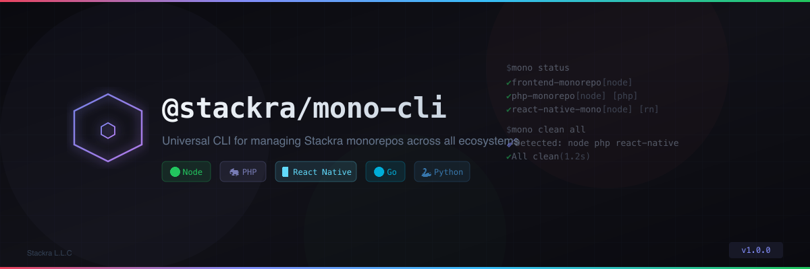

<div align="center">
  
</div>

<h3 align="center">Universal CLI for managing Stackra monorepos across all ecosystems</h3>

<p align="center">
  <a href="https://www.npmjs.com/package/@stackra/mono-cli"></a>
  <a href="https://github.com/stackra-inc/mono-cli/actions/workflows/ci.yml"></a>
  <a href="https://github.com/stackra-inc/mono-cli/blob/main/LICENSE"></a>
  <a href="https://www.npmjs.com/package/@stackra/mono-cli"></a>
</p>

---

## ✨ Features

- 🔍 **Auto-detection** — discovers monorepos and detects Node, PHP, React
  Native, Python, and Go ecosystems automatically
- 🔨 **Turbo-powered** — all task execution goes through Turborepo for caching,
  parallelism, and dependency ordering
- 🧹 **Universal cleanup** — one command cleans build artifacts, caches, and
  dependencies across all ecosystems
- 📊 **Workspace overview** — git status, ecosystem badges, and workspace info at
  a glance
- 🎨 **Beautiful UI** — interactive prompts, spinners, tables, and ASCII banner
  via `@clack/prompts`
- 📦 **JSON output** — `--json` flag for CI/CD pipelines and scripting
- 🏗️ **Class-based DI** — commands are `@Injectable()` classes powered by
  `@stackra/ts-container`
- 🏷️ **Decorator metadata** — `@Command()` decorator for name, description,
  emoji, category, and aliases

## 📥 Install

```bash
# Global install
pnpm add -g @stackra/mono-cli

# Or run directly
npx @stackra/mono-cli
```

## 🚀 Quick Start

```bash
# Show workspace status (default command)
mono

# Clean across all repos
mono clean build          # build artifacts only
mono clean all            # everything

# Run turbo tasks
mono build                # build all repos
mono lint                 # lint all repos
mono test                 # test all repos

# Git operations
mono git status           # status across all repos
mono git push "message"   # commit + push all repos

# Dependency graphs
mono graph                # interactive HTML graph
mono graph -f mermaid     # Mermaid diagram

# CLI info
mono about                # banner + registered commands
```

## 📋 Commands

| Command             | Emoji | Description                              |
| ------------------- | ----- | ---------------------------------------- |
| `mono status`       | 📊    | Show workspace overview and git status   |
| `mono clean [mode]` | 🧹    | Clean artifacts, caches, or dependencies |
| `mono build`        | 🔨    | Build all repos via turbo                |
| `mono lint`         | 🔍    | Lint all repos via turbo                 |
| `mono test`         | 🧪    | Test all repos via turbo                 |
| `mono dev`          | 🚀    | Start dev servers via turbo              |
| `mono format`       | ✨    | Format code with prettier                |
| `mono git status`   | 📊    | Git status across repos                  |
| `mono git push`     | 📤    | Commit + push all repos                  |
| `mono graph`        | 🕸️    | Generate dependency graphs               |
| `mono about`        | ℹ️    | Show CLI info and registered commands    |

## 🎛️ Global Flags

| Flag                | Description                    |
| ------------------- | ------------------------------ |
| `--json`            | Output as JSON (for CI/piping) |
| `--no-interactive`  | Disable prompts (for CI)       |
| `-r, --repo <name>` | Target specific repo(s)        |
| `--verbose`         | Show detailed output           |
| `-v, --version`     | Show version                   |

## 🌐 Ecosystem Support

The CLI auto-detects monorepo types by checking for config files:

| Ecosystem     | Detected By            | Badge |
| ------------- | ---------------------- | ----- |
| Node / TS     | `package.json`         | 🟢    |
| PHP / Laravel | `composer.json`        | 🐘    |
| React Native  | `app.json` + expo deps | 📱    |
| Python        | `pyproject.toml`       | 🐍    |
| Go            | `go.mod`               | 🔵    |

## 🧹 Clean Modes

```bash
mono clean build    # dist, coverage, .next, vendor/public/build
mono clean cache    # turbo, eslint, tsbuildinfo, bootstrap/cache
mono clean deps     # node_modules, vendor, lockfiles
mono clean tmp      # .DS_Store, Thumbs.db
mono clean all      # everything
```

## 🏗️ Architecture

The CLI uses a class-based DI architecture:

```typescript
@Command({
  name: 'build',
  description: 'Build all repos via turbo',
  emoji: '🔨',
  category: 'tasks',
  aliases: ['b'],
})
@Injectable()
class BuildCommand extends BaseCommand {
  async handle(args: string[], opts: GlobalOptions): Promise<void> {
    // ...
  }
}
```

Commands are registered in `CliModule` and resolved via `@stackra/ts-container`
at bootstrap time.

## 📦 Dependencies

- [`commander`](https://github.com/tj/commander.js) — command parsing
- [`@clack/prompts`](https://github.com/bombshell-dev/clack) — interactive UI
- [`chalk`](https://github.com/chalk/chalk) — terminal colors
- [`execa`](https://github.com/sindresorhus/execa) — subprocess execution
- [`@stackra/ts-container`](https://github.com/stackra-inc/ts-container) —
  dependency injection

## 📄 License

[MIT](./LICENSE) © [Stackra L.L.C](https://stackra.com)
